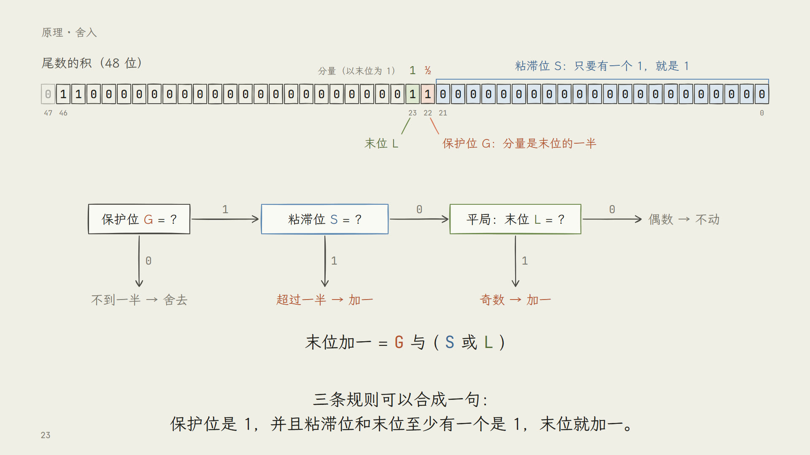
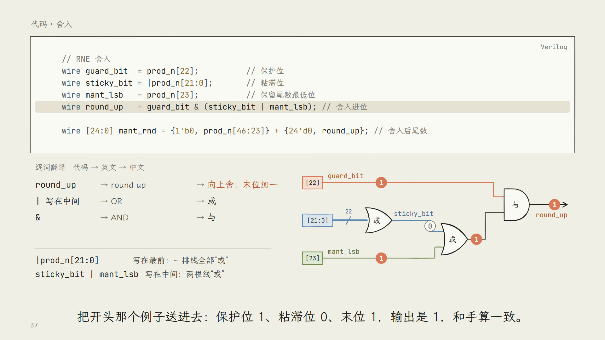

# TechVideo

计算机体系结构与数字电路的中文讲解视频，连同生产这些视频的全部源文件与工具。

一集回答一个问题。每集先讲原理，从高中数学出发把新概念一步步拆开；再讲实现它的真实代码，逐字引用、逐词翻译，并画出每一行对应的电路。





## 系列

| 系列 | 内容 | 进度 |
|---|---|---|
| 浮点乘法 | 情景：做一个 AI 硬件加速器的 FP32 计算核心。从 IEEE 754 与 FTZ 讲到流水线，共 6 集 | 第 4 集「舍入」已完成，其余在规划中 |

各集的概念、前置关系与计划见 `curriculum/01-fp32-mul.md`。

## 特点

- **画面由代码生成**：用 [Remotion](https://www.remotion.dev/)（React 与 SVG）逐帧渲染，浅色暖底，线条手绘，任意一帧都能单独渲染与比对。
- **画面、配音、字幕不会错位**：旁白一句一个音频，时间轴由每句的时长累加得到，字幕与画面动画都按同一条时间轴走。
- **数字有出处**：画面上的位串与结果来自对素材代码的仿真，实验文件与原始输出随每集保存。
- **代码逐字引用**：代码只从素材仓的固定提交中抽取，不改写。
- **规则可检查**：文案、字幕、画面代码、课程依赖的规则都有对应的检查命令，新的一集自动受同一套约束。

## 快速开始

需要 Node 24、git，以及一个 bash 环境（Linux、macOS，或 Windows 上的 WSL）：

```
npm ci
npx skills experimental_install
node tools/link_skills.mjs
bash tools/setup_env.sh              # bash 侧：配音与回听校对的 Python 库、语音识别模型
node tools/vt.mjs check fp32-rne     # 四项检查
node tools/vt.mjs code fp32-rne      # 从素材仓抽代码
node tools/vt.mjs tts fp32-rne       # 分句配音与时间轴
npx remotion studio                  # 预览
node tools/vt.mjs render fp32-rne    # 渲染
node tools/vt.mjs master fp32-rne    # 响度归一化，出成片与字幕
```

完整的环境说明见 `docs/toolchain.md`，一集从立项到发布的九个阶段见 `docs/sop.md`。

## 目录

```
AGENTS.md          入口：上下文分层、目录归属、铁律、命令表
docs/              流程、规范、工程结构、环境、裁决记录
curriculum/        系列大纲、概念表、代码词汇表、素材源码登记
src/               所有视频共用的底座与组件
videos/<id>/       一集的大纲、脚本、画面、出处、状态
tools/             统一入口 vt.mjs 与各项检查
```

## 参与制作

人或 AI agent 接手时从 `AGENTS.md` 开始读，它列出了阅读顺序、每类文件的归属和不能违反的规则。

## 许可证

- 代码（`.ts`、`.tsx`、`.mjs`、`.cjs`、`.py`、`.sh`、`.v` 与工程配置）：MIT，见 `LICENSE`。
- 内容（文档、课程登记、脚本、大纲、成片与图片）：CC BY-NC-SA 4.0，见 `LICENSE-CONTENT.md`。
- 视频里引用的代码来自 [Anchorfp](https://github.com/f0d471/Anchorfp)，以 SHL-2.1 或 Apache-2.0 许可。
- 字体霞鹜文楷与 JetBrains Mono 以 SIL OFL 1.1 许可。
- Remotion 使用自己的许可证，部分组织商用需要购买授权，见 [remotion.dev/license](https://www.remotion.dev/license)。
